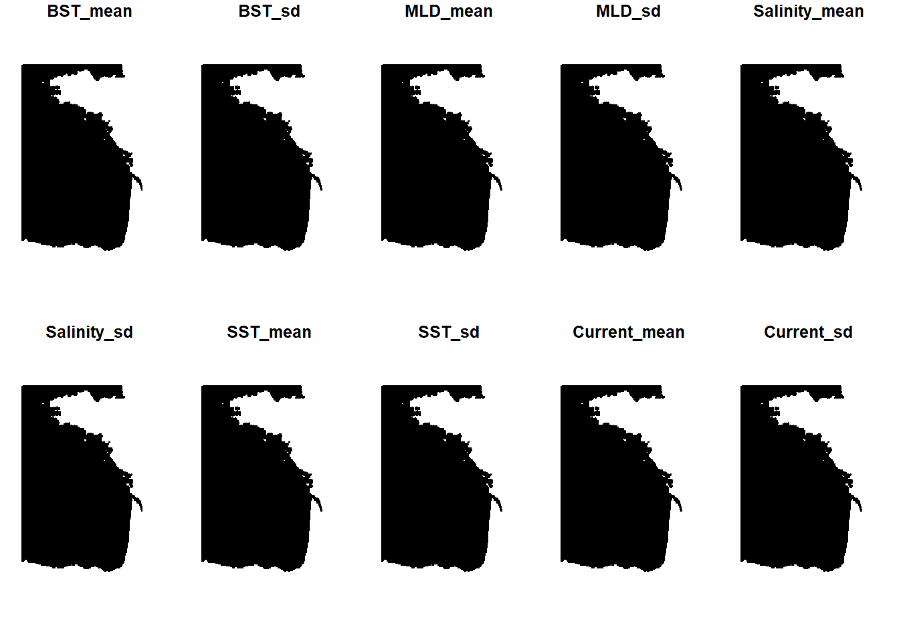
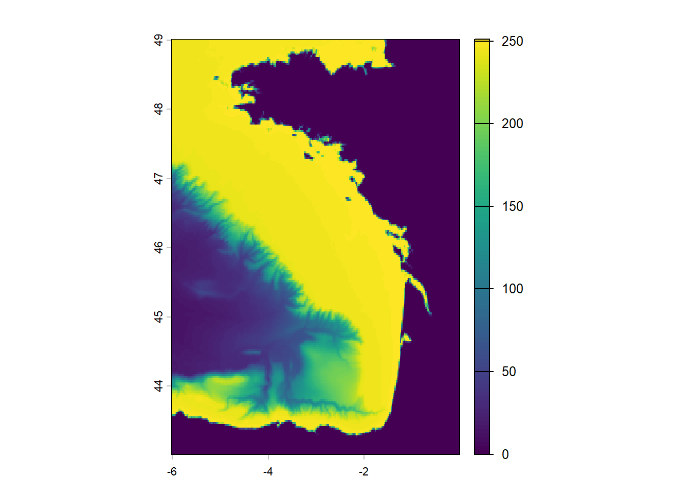
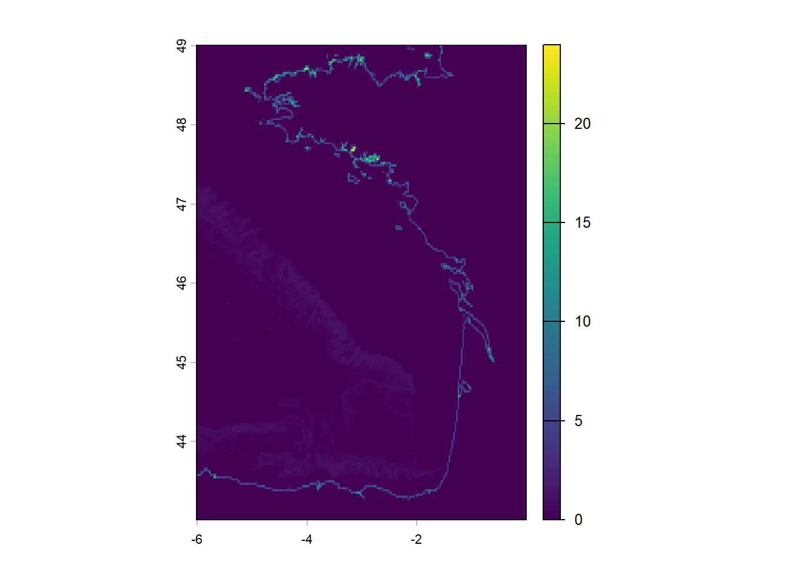
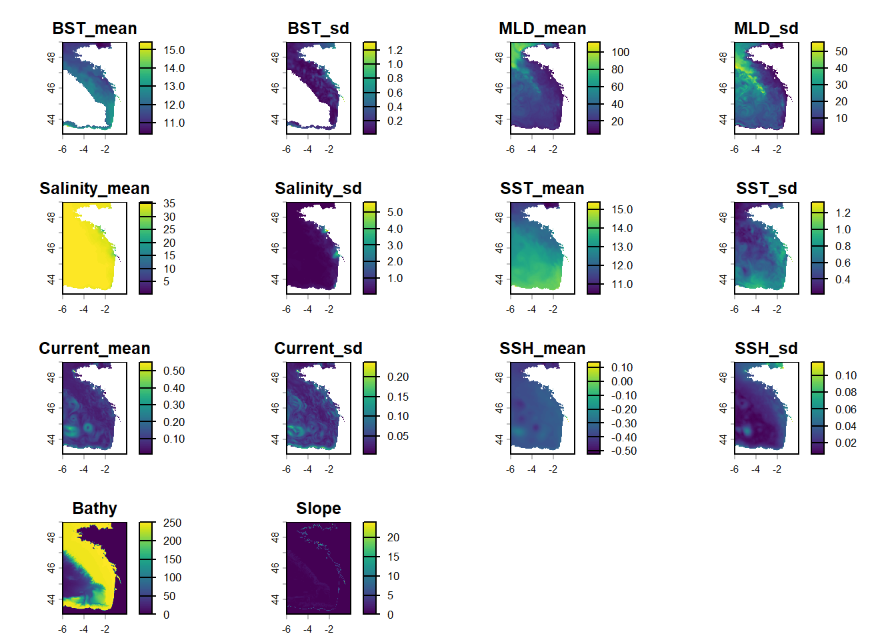
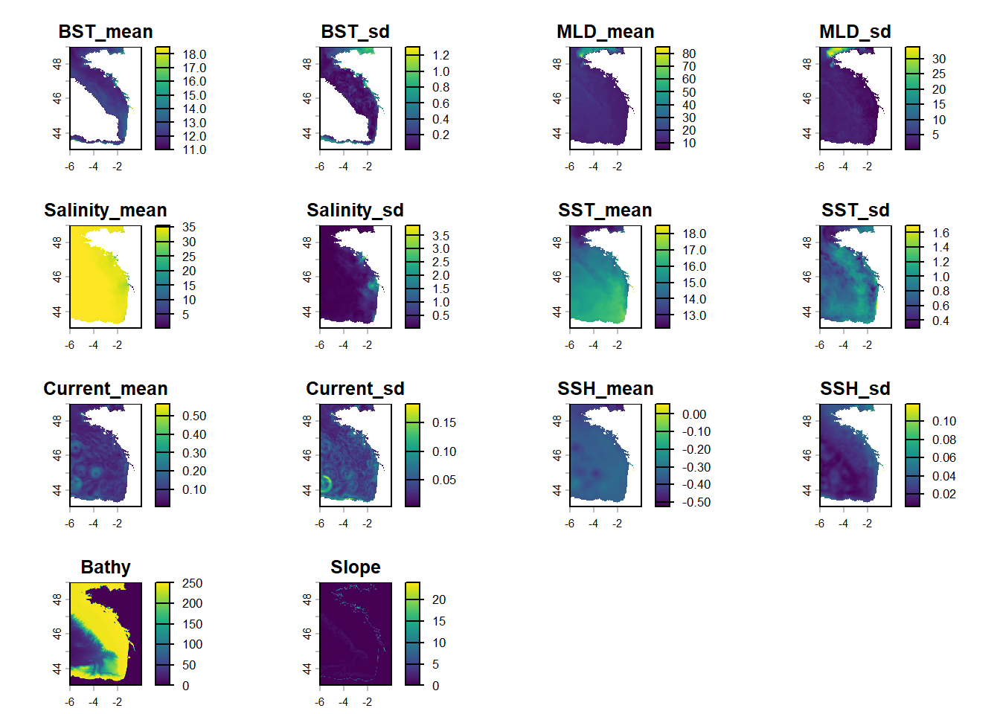

# Processing climatologies

## Introduction

This vignette is presenting a method to create co variable raster from
environmental information, in order to add climatologies to effort
table. It describes a way to download a .nc file from
https://marine.copernicus.eu using Python API. Then the file is
transform to generate mean per month and year in rasters.

## Initiate

It is needed to create a temporary file to store the climatologies from
https://marine.copernicus.eu.

``` r
temp_file <- tempdir()
```

## 1 - Download climatologies from copernicus

Copernicus Marine makes available a API function to import climatologies
from their website.

In order to download with the API, it’ needed to be register online to
give a login and a password (can be done on the website :
https://data.marine.copernicus.eu/). These information needs to be
change in the function “copernicusmarine.login”.

Then, “copernicusmarine.subset” needs to be updated with the different
information : id, variables, location, datetime and output directory.

“dataset_id” and “variables” must be taken from the catalog.

``` python
import copernicusmarine

#copernicusmarine.login(username= <"LOGIN"> , password= <"PASSWORD">) 

copernicusmarine.subset(
  dataset_id="cmems_mod_ibi_phy_anfc_0.027deg-3D_P1D-m",
  variables=["bottomT", "mlotst", "so", "thetao", "uo", "vo", "zos"],
  minimum_longitude=-6,
  maximum_longitude=0,
  minimum_latitude=43,
  maximum_latitude=49,
  start_datetime="2022-04-01T00:00:00",
  end_datetime="2023-05-31T00:00:00",
  minimum_depth=0.5057600140571594,
  maximum_depth=0.5057600140571594,
  output_directory= r.temp_file
)
#> 
  0%|          | 0/86 [00:00<?, ?it/s]
  1%|1         | 1/86 [00:04<05:59,  4.23s/it]
  7%|6         | 6/86 [00:04<00:43,  1.86it/s]
 10%|#         | 9/86 [00:04<00:24,  3.09it/s]
 17%|#7        | 15/86 [00:04<00:11,  6.27it/s]
 27%|##6       | 23/86 [00:04<00:05, 11.82it/s]
 33%|###2      | 28/86 [00:05<00:04, 12.48it/s]
 37%|###7      | 32/86 [00:05<00:05,  9.40it/s]
 41%|####      | 35/86 [00:06<00:06,  8.25it/s]
 43%|####3     | 37/86 [00:06<00:06,  7.81it/s]
 48%|####7     | 41/86 [00:06<00:04, 10.52it/s]
 57%|#####6    | 49/86 [00:06<00:02, 17.07it/s]
 64%|######3   | 55/86 [00:07<00:01, 19.70it/s]
 69%|######8   | 59/86 [00:07<00:01, 19.65it/s]
 79%|#######9  | 68/86 [00:07<00:00, 29.61it/s]
 87%|########7 | 75/86 [00:07<00:00, 34.00it/s]
 97%|#########6| 83/86 [00:07<00:00, 42.43it/s]
100%|##########| 86/86 [00:07<00:00, 11.20it/s]
#> ResponseSubset(file_path=WindowsPath('C:/Users/GUILLA~1/AppData/Local/Temp/RtmpeAT1x5/cmems_mod_ibi_phy_anfc_0.027deg-3D_P1D-m_multi-vars_6.00W-0.03W_43.03N-49.00N_0.49m_2022-11-23-2023-05-31.nc'), output_directory=WindowsPath('C:/Users/GUILLA~1/AppData/Local/Temp/RtmpeAT1x5'), filename='cmems_mod_ibi_phy_anfc_0.027deg-3D_P1D-m_multi-vars_6.00W-0.03W_43.03N-49.00N_0.49m_2022-11-23-2023-05-31.nc', file_size=118.43376335877863, data_transfer_size=1518.8343206106867, variables=['bottomT', 'mlotst', 'so', 'thetao', 'uo', 'vo', 'zos'], coordinates_extent=[GeographicalExtent(minimum=-5.999106370000001, maximum=-0.026700920000000905, unit='degrees_east', coordinate_id='longitude'), GeographicalExtent(minimum=43.02698567, maximum=48.99939112, unit='degrees_north', coordinate_id='latitude'), TimeExtent(minimum='2022-11-23T00:00:00+00:00', maximum='2023-05-31T00:00:00+00:00', unit='iso8601', coordinate_id='time'), GeographicalExtent(minimum=0.4940253794193268, maximum=0.4940253794193268, unit='m', coordinate_id='depth')], status='000', message='The request was successful.', file_status='DOWNLOADED')
```

The function import a ‘.nc’ files with all the climatologies downloaded
in the area for the complete period.

``` r
file_nc <- list.files(temp_file, full.names = TRUE, pattern=".nc")
file_nc
#> [1] "C:\\Users\\GUILLA~1\\AppData\\Local\\Temp\\RtmpeAT1x5/cmems_mod_ibi_phy_anfc_0.027deg-3D_P1D-m_multi-vars_6.00W-0.03W_43.03N-49.00N_0.49m_2022-11-23-2023-05-31.nc"
```

## 2 - Manipulate climatologies

After downloading the complete climatologies, the .nc file must be
transform to get rasters per year and month.

``` r
library(tidyverse)
library(terra)
library(sf)
library(ncdf4)
library(tidyterra)
library(cli)
library(stars)
library(glue)
library(raster)
```

``` r

Sys.setlocale("LC_TIME", "English")
#> [1] "English_United States.1252"

### A - Open all file names containing ".nc" in the environment ----------------
files <- file_nc[1]

names(nc_open(file_nc[1])$var)
#> [1] "bottomT" "mlotst"  "so"      "thetao"  "uo"      "vo"      "zos"

# Get all date
# date <- cbind(year(unique(time(rast(files)))), month.name[month(unique(time(rast(files))))]) %>% as.data.frame() %>%  dplyr::distinct()
# nc_month <- date[,2]
# nc_year <-  date[,1]

# select date for survey
date <- cbind(c("2023", "2023"), c("April", "May" )) %>% as.data.frame()
nc_month <- date[,2]
nc_year <-  date[,1]


# Gate names

list_name <- list("bottomT" = "BST", 
                  "so" = "Salinity", 
                  "thetao" = "SST", 
                  "so" = "SSS", 
                  "uo" = "Current",
                  "chl" = "CHL",
                  "nppv" = "NPP",
                  "vo" = NA, 
                  "ue" = "Current",
                  "ve" = NA,
                  "mlotst" = "MLD", 
                  "zos" = "SSH")
nc_varname <- names(nc_open(file_nc[1])$var)
nc_varname_associate <- unlist(map(.x = nc_varname, .f = function(x){list_name[[x]]}))
  
# Add name of variables
vars <- data.frame(
  var_long = nc_varname_associate, 
  var_short = nc_varname) %>% drop_na() 

        

# Loop to extract values -----------------

for(i in 1:dim(date)[1]){
  
    rast_final <- rast()

    annee <- date[i,1]
    mois <- date[i,2]

    for(var_number in 1:length(vars$var_long)) {
      
      var = vars$var_long[var_number] 
      
      if(var == "Current"){
      
        u <- rast(files, subds = "uo")
        v <- rast(files, subds = "vo")
        
        u <- u[[which(year(time(u)) == annee)]]
        v <- v[[which(year(time(v)) == annee)]]
        u <- u[[which(months(time(u)) == mois)]]
        v <- v[[which(months(time(v)) == mois)]]
      
       rast_current <- sqrt( u^2 + v^2) 
      
        ## merge and compute mean and sd
       mean_var_current <- mean(rast_current, na.rm = T) |> setNames("Current_mean")
       sd_var_current <- stdev(rast_current, na.rm = T) |> setNames("Current_sd")
      
       rast_final <- c(rast_final, mean_var_current, sd_var_current, overwrite=TRUE)

      } else {
        
        if(var == "EKE"){
      
        u <- rast(files, subds = "ue")
        v <- rast(files, subds = "ve")
        
        u <- u[[which(year(time(u)) == annee)]]
        v <- v[[which(year(time(v)) == annee)]]
        u <- u[[which(months(time(u)) == mois)]]
        v <- v[[which(months(time(v)) == mois)]]
      
       rast_eke <-0.5*(  u^2 +  v^2 )
      
        ## merge and compute mean and sd
       mean_var_eke <- mean(rast_eke, na.rm = T) |> setNames("EKE_mean")
       sd_var_eke <- stdev(rast_eke, na.rm = T) |> setNames("EKE_sd")
      
       rast_final <- c(rast_final, mean_var_eke, sd_var_eke, overwrite=TRUE)
       
        } else {
        
      
      ## open, merge and subset dates
      rast_select <- rast(files, subds = vars$var_short[var_number] )
      rast_select <- rast_select[[which(year(time(rast_select)) == annee)]]
      rast_select <- rast_select[[which(months(time(rast_select)) == mois)]]
      
      ## compute mean and sd
      mean_select <- mean(rast_select, na.rm = T) |> setNames(paste0(vars$var_long[var_number], "_mean"))
      sd_select <- stdev(rast_select, na.rm = T) |> setNames(paste0(vars$var_long[var_number], "_sd"))
      
      ## merge
      rast_final <- c(rast_final, mean_select, sd_select)

    
        }
      }  
    }

   time(rast_final) <- rep(as.Date(paste("01", mois, annee), format = "%d %B %Y") , length(time(rast_final)))
   writeRaster(rast_final, paste0(temp_file, "/", annee, "_", mois, '.tif'), overwrite=TRUE)
   
}
#> Warning: [rast] the first raster was empty and was ignored
#> Warning: [rast] 1 out of 4 elements of x are not a SpatRaster
#> Warning: [rast] the first raster was empty and was ignored
#> Warning: [rast] 1 out of 4 elements of x are not a SpatRaster


rast_final
#> class       : SpatRaster 
#> size        : 216, 216, 12  (nrow, ncol, nlyr)
#> resolution  : 0.02777863, 0.02777863  (x, y)
#> extent      : -6.012996, -0.01281161, 43.0131, 49.01328  (xmin, xmax, ymin, ymax)
#> coord. ref. : lon/lat WGS 84 (CRS84) (OGC:CRS84) 
#> source(s)   : memory
#> names       : BST_mean,     BST_sd,  MLD_mean,      MLD_sd, Salin~_mean, Salinity_sd, ... 
#> min values  : 10.98626, 0.00958222,  4.541906,  0.04205937,  0.08774099, 0.000395079, ... 
#> max values  : 18.51610, 1.30521572, 85.219326, 33.82404881, 35.62377494, 3.878500275, ... 
#> time (days) : 2023-05-01
```

## 3 - Check output

``` r
file_tif <- list.files(temp_file, pattern = '.tif', full.names = TRUE)
file_tif
#> [1] "C:\\Users\\GUILLA~1\\AppData\\Local\\Temp\\RtmpeAT1x5/2023_April.tif"
#> [2] "C:\\Users\\GUILLA~1\\AppData\\Local\\Temp\\RtmpeAT1x5/2023_May.tif"
```

``` r
plot(st_as_sf(read_stars(file_tif[1])))
#> Warning: plotting the first 10 out of 12 attributes; use max.plot = 12 to plot
#> all
```



## 4 - Bathymetry and Slope

Here we download bathymetrie from Emodnet:
https://emodnet.ec.europa.eu/.

``` r
## Build final raster stacks - add bathy/slope and resample to same resolution
resample <- function(rast_to_resample, base_raster){
  rspl <- stars::st_as_stars(rast_to_resample) %>%
    stars::st_warp(., stars::st_as_stars(base_raster), method = "average", use_gdal = T) %>%
    as(., Class = "SpatRaster")
  return(rspl)
}
```

``` r
# Bathymetrie
path_bathymetry <- system.file(package = "pelascope", "bathymetry.geotif")
raster_bathy <- rast(path_bathymetry)

# Slope
slope <- raster::terrain(raster_bathy, 
                         v = "slope", 
                         neighbors = 8, 
                         unit = "degrees")
#> 
|---------|---------|---------|---------|
=========================================
                                          

# resample
bathy <- resample(rast_to_resample = raster_bathy$bathymetry,
                  base_raster = rast_final$BST_mean) %>% setNames("Bathy")
#> Warning in CPL_get_metadata(file, NA_character_, options): GDAL Message 1:
#> bathymetry.geotif: TIFFFetchNormalTag:incorrect count for field "PageNumber",
#> expected 2, got 1
#> Warning in CPL_get_metadata(file, NA_character_, options): GDAL Message 1:
#> TIFFFetchNormalTag:incorrect count for field "PageNumber", expected 2, got 1
#> Warning in CPL_read_gdal(as.character(x), as.character(options),
#> as.character(driver), : GDAL Message 1: bathymetry.geotif:
#> TIFFFetchNormalTag:incorrect count for field "PageNumber", expected 2, got 1
#> Warning in CPL_read_gdal(as.character(x), as.character(options),
#> as.character(driver), : GDAL Message 1: TIFFFetchNormalTag:incorrect count for
#> field "PageNumber", expected 2, got 1
#> Warning in stars::st_warp(., stars::st_as_stars(base_raster), method =
#> "average", : no_data_value not set: missing values will appear as zero values
#> Warning in CPL_gdal_warper(source, destination,
#> as.integer(resampling_method(options)), : GDAL Message 1: bathymetry.geotif:
#> TIFFFetchNormalTag:incorrect count for field "PageNumber", expected 2, got 1
#> Warning in CPL_gdal_warper(source, destination,
#> as.integer(resampling_method(options)), : GDAL Message 1:
#> TIFFFetchNormalTag:incorrect count for field "PageNumber", expected 2, got 1
plot(bathy)
```



``` r
slope <-  resample(rast_to_resample = slope$slope,
                  base_raster = rast_final$BST_mean) %>% setNames("Slope")
#> Warning in stars::st_warp(., stars::st_as_stars(base_raster), method =
#> "average", : no_data_value not set: missing values will appear as zero values
plot(slope)
```



``` r
file_tif <- list.files(temp_file, pattern = '.tif', full.names = TRUE)

save_raster_path <- glue("{temp_file}/clean/")
dir.create(save_raster_path)

file_tif[1:2] %>% 
  map(.f = function(x){
    raster <- rast(x)
    time(bathy) <- time(raster$BST_mean)
    time(slope) <- time(raster$BST_mean)
    raster <- c(raster, bathy, slope) 
    writeRaster(raster, filename = glue("{temp_file}/clean/{unique(month(time(raster)))}_{unique(year(time(raster)))}.tif"), overwrite = T)  
    return(plot(raster))
  })
```





    #> [[1]]
    #> NULL
    #>
    #> [[2]]
    #> NULL

5 - Associate Covariate

Now it’s time to associate covariate to effort table.

``` r
library(pelascope)
#> Warning: replacing previous import 'Distance::create.bins' by
#> 'mrds::create.bins' when loading 'pelaCDS'
#> Warning: replacing previous import 'magrittr::set_names' by 'purrr::set_names'
#> when loading 'pelascope'
associate_covariate(effort_table = pelascope::data_effort_with_sightings,
                    raster_folder = save_raster_path, 
                    temporal = "month")
#> Simple feature collection with 390 features and 228 fields
#> Geometry type: POINT
#> Dimension:     XY
#> Bounding box:  xmin: -5.657199 ymin: 43.66589 xmax: -1.253505 ymax: 48.31222
#> Geodetic CRS:  WGS 84
#> # A tibble: 390 × 229
#>    Beaufort TransectID         plateform         n_obs LegID Start_time         
#>  *    <dbl> <chr>              <chr>             <dbl> <chr> <dttm>             
#>  1        2 TR_Pelgas_30042023 upper_bridge_out…     2 3004… 2023-04-30 06:37:02
#>  2        3 TR_Pelgas_30042023 upper_bridge_out…     2 3004… 2023-04-30 09:10:20
#>  3        3 TR_Pelgas_30042023 upper_bridge_out…     2 3004… 2023-04-30 09:10:20
#>  4        3 TR_Pelgas_30042023 upper_bridge_out…     2 3004… 2023-04-30 09:10:20
#>  5        3 TR_Pelgas_30042023 upper_bridge_out…     2 3004… 2023-04-30 09:10:20
#>  6        3 TR_Pelgas_30042023 upper_bridge_out…     2 3004… 2023-04-30 09:10:20
#>  7        3 TR_Pelgas_30042023 upper_bridge_out…     2 3004… 2023-04-30 09:10:20
#>  8        3 TR_Pelgas_30042023 upper_bridge_out…     2 3004… 2023-04-30 09:10:20
#>  9        3 TR_Pelgas_30042023 upper_bridge_out…     2 3004… 2023-04-30 09:10:20
#> 10        3 TR_Pelgas_30042023 upper_bridge_out…     2 3004… 2023-04-30 09:10:20
#> # ℹ 380 more rows
#> # ℹ 223 more variables: DateTime <dttm>, End_time <dttm>, SegID <chr>,
#> #   Effort <dbl>, geometry <POINT [°]>, det.PHACAR <int>, ind.PHACAR <int>,
#> #   det.BUOY <int>, ind.BUOY <int>, det.MOTOBO <int>, ind.MOTOBO <int>,
#> #   det.LARFUS <int>, ind.LARFUS <int>, det.SULBAS <int>, ind.SULBAS <int>,
#> #   det.SAILBO <int>, ind.SAILBO <int>, det.LARGUL <int>, ind.LARGUL <int>,
#> #   det.PHAARI <int>, ind.PHAARI <int>, det.LARMAR <int>, ind.LARMAR <int>, …
```

``` r
unlink(temp_file, recursive = TRUE, force = TRUE)
list.files(temp_file)
#> [1] "cmems_mod_ibi_phy_anfc_0.027deg-3D_P1D-m_multi-vars_6.00W-0.03W_43.03N-49.00N_0.49m_2022-11-23-2023-05-31.nc"
#> [2] "file596c46586c98"                                                                                            
#> [3] "Rf596c17537522"
```
