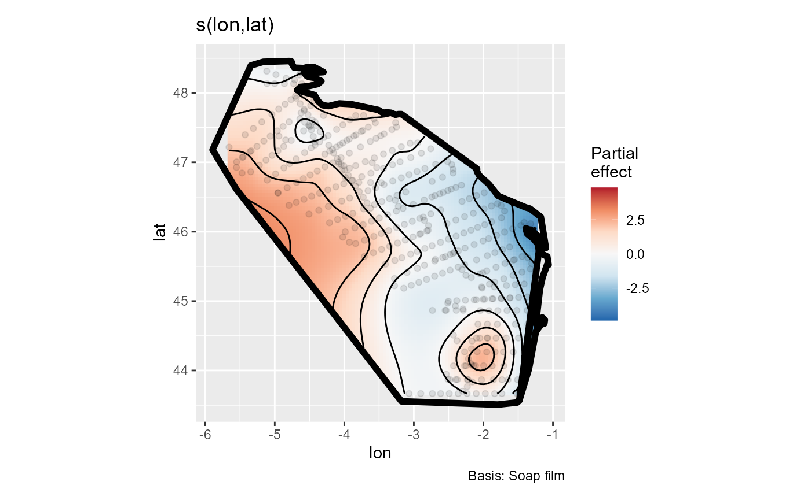
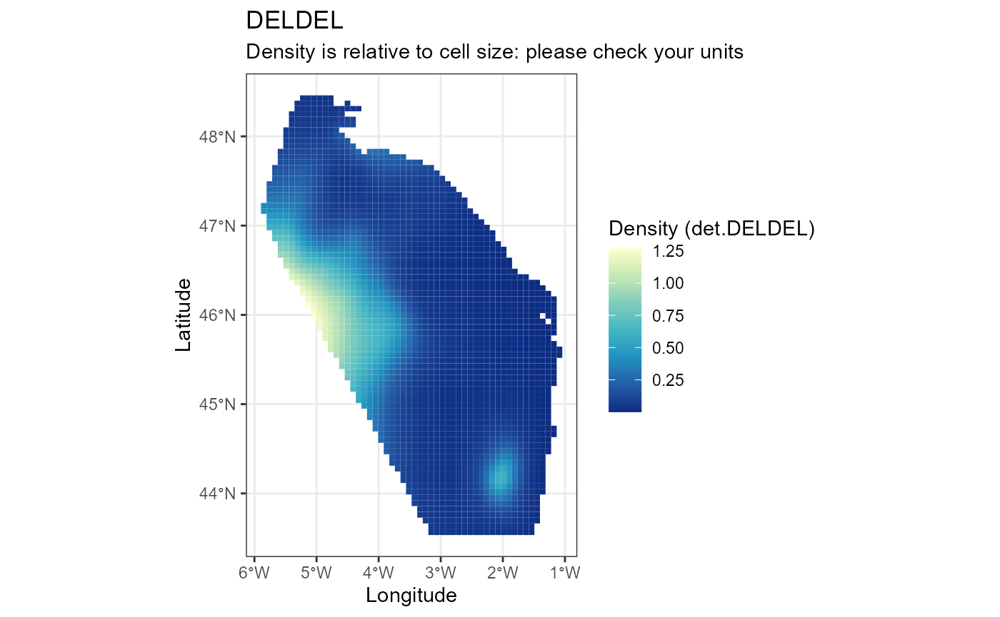

# Calculation

``` r
library(pelascope)
#> Warning: replacing previous import 'Distance::create.bins' by
#> 'mrds::create.bins' when loading 'pelaCDS'
#> Warning: replacing previous import 'magrittr::set_names' by 'purrr::set_names'
#> when loading 'pelascope'
```

## make_soap

``` r
Effort <- pelascope::data_effort_with_sightings

make_soap(Effort)
```


    #> $bound
    #> $bound[[1]]
    #> $bound[[1]]$lon
    #>  [1] -1.484863 -1.345996 -1.245508 -1.170801 -1.121862 -1.116507 -1.152881
    #>  [8] -1.200391 -1.220312 -1.245215 -1.189062 -1.149072 -1.081006 -1.041936
    #> [15] -1.058975 -1.169971 -1.195996 -1.209961 -1.114355 -1.077349 -1.099978
    #> [22] -1.104395 -1.112891 -1.137902 -1.347234 -1.392480 -1.786523 -1.921436
    #> [29] -2.059375 -2.092480 -2.090372 -3.003076 -3.064209 -3.158838 -3.221582
    #> [36] -3.264697 -3.328613 -3.395898 -3.443945 -3.507813 -3.900928 -4.070703
    #> [43] -4.226416 -4.312109 -4.375098 -4.427979 -4.678809 -4.629199 -4.512402
    #> [50] -4.377832 -4.329443 -4.434619 -4.512207 -4.544336 -4.577148 -4.530664
    #> [57] -4.497900 -4.403320 -4.295179 -4.429015 -4.524805 -4.584717 -4.719385
    #> [64] -4.748535 -4.762500 -4.761131 -4.792350 -5.257865 -5.894158 -5.553697
    #> [71] -4.192340 -3.137817 -1.792840 -1.514340 -1.484863 -1.178320 -1.213574
    #> [78] -1.280273 -1.368701 -1.388867 -1.388672 -1.285059 -1.178320
    #> 
    #> $bound[[1]]$lat
    #>  [1] 43.56377 44.02021 44.55986 44.66182 44.67644 44.72851 44.76401 44.72646
    #>  [9] 44.68662 44.66670 45.16147 45.34263 45.53242 45.51132 45.62943 45.68594
    #> [17] 45.71445 45.77090 45.76851 45.75622 45.91160 45.92534 45.99987 46.17004
    #> [25] 46.33694 46.35010 46.51484 46.68481 46.81030 46.86504 46.91828 47.60898
    #> [33] 47.62134 47.69468 47.69414 47.68511 47.71333 47.72041 47.71104 47.75312
    #> [41] 47.83755 47.84785 47.80962 47.82290 47.87744 47.96895 48.03950 48.08579
    #> [49] 48.09673 48.12881 48.16997 48.21797 48.22974 48.24697 48.29004 48.30972
    #> [57] 48.29927 48.29307 48.30017 48.36892 48.37231 48.35752 48.36313 48.41001
    #> [65] 48.45024 48.45319 48.45917 48.43885 47.18012 46.61329 44.88593 43.55620
    #> [73] 43.50822 43.53854 43.56377 45.90405 45.81660 45.89712 45.96768 46.03296
    #> [81] 46.05039 46.00269 45.90405
    #> 
    #> 
    #> 
    #> $knots
    #>           lon      lat
    #> 37  -3.026936 43.73327
    #> 38  -2.806381 43.73327
    #> 39  -2.585825 43.73327
    #> 40  -2.365269 43.73327
    #> 41  -2.144714 43.73327
    #> 42  -1.924158 43.73327
    #> 43  -1.703603 43.73327
    #> 59  -3.247492 43.95831
    #> 60  -3.026936 43.95831
    #> 61  -2.806381 43.95831
    #> 62  -2.585825 43.95831
    #> 63  -2.365269 43.95831
    #> 64  -2.144714 43.95831
    #> 65  -1.924158 43.95831
    #> 66  -1.703603 43.95831
    #> 81  -3.468047 44.18335
    #> 82  -3.247492 44.18335
    #> 83  -3.026936 44.18335
    #> 84  -2.806381 44.18335
    #> 85  -2.585825 44.18335
    #> 86  -2.365269 44.18335
    #> 87  -2.144714 44.18335
    #> 88  -1.924158 44.18335
    #> 89  -1.703603 44.18335
    #> 90  -1.483047 44.18335
    #> 104 -3.468047 44.40840
    #> 105 -3.247492 44.40840
    #> 106 -3.026936 44.40840
    #> 107 -2.806381 44.40840
    #> 108 -2.585825 44.40840
    #> 109 -2.365269 44.40840
    #> 110 -2.144714 44.40840
    #> 111 -1.924158 44.40840
    #> 112 -1.703603 44.40840
    #> 113 -1.483047 44.40840
    #> 126 -3.688603 44.63344
    #> 127 -3.468047 44.63344
    #> 128 -3.247492 44.63344
    #> 129 -3.026936 44.63344
    #> 130 -2.806381 44.63344
    #> 131 -2.585825 44.63344
    #> 132 -2.365269 44.63344
    #> 133 -2.144714 44.63344
    #> 134 -1.924158 44.63344
    #> 135 -1.703603 44.63344
    #> 136 -1.483047 44.63344
    #> 148 -3.909158 44.85848
    #> 149 -3.688603 44.85848
    #> 150 -3.468047 44.85848
    #> 151 -3.247492 44.85848
    #> 152 -3.026936 44.85848
    #> 153 -2.806381 44.85848
    #> 154 -2.585825 44.85848
    #> 155 -2.365269 44.85848
    #> 156 -2.144714 44.85848
    #> 157 -1.924158 44.85848
    #> 158 -1.703603 44.85848
    #> 159 -1.483047 44.85848
    #> 170 -4.129714 45.08353
    #> 171 -3.909158 45.08353
    #> 172 -3.688603 45.08353
    #> 173 -3.468047 45.08353
    #> 174 -3.247492 45.08353
    #> 175 -3.026936 45.08353
    #> 176 -2.806381 45.08353
    #> 177 -2.585825 45.08353
    #> 178 -2.365269 45.08353
    #> 179 -2.144714 45.08353
    #> 180 -1.924158 45.08353
    #> 181 -1.703603 45.08353
    #> 182 -1.483047 45.08353
    #> 192 -4.350269 45.30857
    #> 193 -4.129714 45.30857
    #> 194 -3.909158 45.30857
    #> 195 -3.688603 45.30857
    #> 196 -3.468047 45.30857
    #> 197 -3.247492 45.30857
    #> 198 -3.026936 45.30857
    #> 199 -2.806381 45.30857
    #> 200 -2.585825 45.30857
    #> 201 -2.365269 45.30857
    #> 202 -2.144714 45.30857
    #> 203 -1.924158 45.30857
    #> 204 -1.703603 45.30857
    #> 205 -1.483047 45.30857
    #> 215 -4.350269 45.53361
    #> 216 -4.129714 45.53361
    #> 217 -3.909158 45.53361
    #> 218 -3.688603 45.53361
    #> 219 -3.468047 45.53361
    #> 220 -3.247492 45.53361
    #> 221 -3.026936 45.53361
    #> 222 -2.806381 45.53361
    #> 223 -2.585825 45.53361
    #> 224 -2.365269 45.53361
    #> 225 -2.144714 45.53361
    #> 226 -1.924158 45.53361
    #> 227 -1.703603 45.53361
    #> 228 -1.483047 45.53361
    #> 229 -1.262492 45.53361
    #> 237 -4.570825 45.75865
    #> 238 -4.350269 45.75865
    #> 239 -4.129714 45.75865
    #> 240 -3.909158 45.75865
    #> 241 -3.688603 45.75865
    #> 242 -3.468047 45.75865
    #> 243 -3.247492 45.75865
    #> 244 -3.026936 45.75865
    #> 245 -2.806381 45.75865
    #> 246 -2.585825 45.75865
    #> 247 -2.365269 45.75865
    #> 248 -2.144714 45.75865
    #> 249 -1.924158 45.75865
    #> 250 -1.703603 45.75865
    #> 251 -1.483047 45.75865
    #> 259 -4.791381 45.98370
    #> 260 -4.570825 45.98370
    #> 261 -4.350269 45.98370
    #> 262 -4.129714 45.98370
    #> 263 -3.909158 45.98370
    #> 264 -3.688603 45.98370
    #> 265 -3.468047 45.98370
    #> 266 -3.247492 45.98370
    #> 267 -3.026936 45.98370
    #> 268 -2.806381 45.98370
    #> 269 -2.585825 45.98370
    #> 270 -2.365269 45.98370
    #> 271 -2.144714 45.98370
    #> 272 -1.924158 45.98370
    #> 273 -1.703603 45.98370
    #> 281 -5.011936 46.20874
    #> 282 -4.791381 46.20874
    #> 283 -4.570825 46.20874
    #> 284 -4.350269 46.20874
    #> 285 -4.129714 46.20874
    #> 286 -3.909158 46.20874
    #> 287 -3.688603 46.20874
    #> 288 -3.468047 46.20874
    #> 289 -3.247492 46.20874
    #> 290 -3.026936 46.20874
    #> 291 -2.806381 46.20874
    #> 292 -2.585825 46.20874
    #> 293 -2.365269 46.20874
    #> 294 -2.144714 46.20874
    #> 295 -1.924158 46.20874
    #> 296 -1.703603 46.20874
    #> 297 -1.483047 46.20874
    #> 303 -5.232492 46.43378
    #> 304 -5.011936 46.43378
    #> 305 -4.791381 46.43378
    #> 306 -4.570825 46.43378
    #> 307 -4.350269 46.43378
    #> 308 -4.129714 46.43378
    #> 309 -3.909158 46.43378
    #> 310 -3.688603 46.43378
    #> 311 -3.468047 46.43378
    #> 312 -3.247492 46.43378
    #> 313 -3.026936 46.43378
    #> 314 -2.806381 46.43378
    #> 315 -2.585825 46.43378
    #> 316 -2.365269 46.43378
    #> 317 -2.144714 46.43378
    #> 318 -1.924158 46.43378
    #> 326 -5.232492 46.65883
    #> 327 -5.011936 46.65883
    #> 328 -4.791381 46.65883
    #> 329 -4.570825 46.65883
    #> 330 -4.350269 46.65883
    #> 331 -4.129714 46.65883
    #> 332 -3.909158 46.65883
    #> 333 -3.688603 46.65883
    #> 334 -3.468047 46.65883
    #> 335 -3.247492 46.65883
    #> 336 -3.026936 46.65883
    #> 337 -2.806381 46.65883
    #> 338 -2.585825 46.65883
    #> 339 -2.365269 46.65883
    #> 340 -2.144714 46.65883
    #> 348 -5.453047 46.88387
    #> 349 -5.232492 46.88387
    #> 350 -5.011936 46.88387
    #> 351 -4.791381 46.88387
    #> 352 -4.570825 46.88387
    #> 353 -4.350269 46.88387
    #> 354 -4.129714 46.88387
    #> 355 -3.909158 46.88387
    #> 356 -3.688603 46.88387
    #> 357 -3.468047 46.88387
    #> 358 -3.247492 46.88387
    #> 359 -3.026936 46.88387
    #> 360 -2.806381 46.88387
    #> 361 -2.585825 46.88387
    #> 362 -2.365269 46.88387
    #> 370 -5.673603 47.10891
    #> 371 -5.453047 47.10891
    #> 372 -5.232492 47.10891
    #> 373 -5.011936 47.10891
    #> 374 -4.791381 47.10891
    #> 375 -4.570825 47.10891
    #> 376 -4.350269 47.10891
    #> 377 -4.129714 47.10891
    #> 378 -3.909158 47.10891
    #> 379 -3.688603 47.10891
    #> 380 -3.468047 47.10891
    #> 381 -3.247492 47.10891
    #> 382 -3.026936 47.10891
    #> 383 -2.806381 47.10891
    #> 384 -2.585825 47.10891
    #> 393 -5.673603 47.33396
    #> 394 -5.453047 47.33396
    #> 395 -5.232492 47.33396
    #> 396 -5.011936 47.33396
    #> 397 -4.791381 47.33396
    #> 398 -4.570825 47.33396
    #> 399 -4.350269 47.33396
    #> 400 -4.129714 47.33396
    #> 401 -3.909158 47.33396
    #> 402 -3.688603 47.33396
    #> 403 -3.468047 47.33396
    #> 404 -3.247492 47.33396
    #> 405 -3.026936 47.33396
    #> 417 -5.453047 47.55900
    #> 418 -5.232492 47.55900
    #> 419 -5.011936 47.55900
    #> 420 -4.791381 47.55900
    #> 421 -4.570825 47.55900
    #> 422 -4.350269 47.55900
    #> 423 -4.129714 47.55900
    #> 424 -3.909158 47.55900
    #> 425 -3.688603 47.55900
    #> 426 -3.468047 47.55900
    #> 427 -3.247492 47.55900
    #> 441 -5.232492 47.78404
    #> 442 -5.011936 47.78404
    #> 443 -4.791381 47.78404
    #> 444 -4.570825 47.78404
    #> 464 -5.232492 48.00909
    #> 465 -5.011936 48.00909
    #> 488 -5.011936 48.23413
    #> 489 -4.791381 48.23413

## fit_and_predict

``` r


fit_and_predict(effort_table = data_effort_esw, 
                response_y = "det.DELDEL", 
                family = "negbin", 
                knots = knots_bound$knots, 
                bound = knots_bound$bound, 
                species = "DELDEL", 
                prediction_grid = NULL, 
                covariates_x = NULL, 
                save = NULL)
#> 
#> ── Start fitting ───────────────────────────────────────────────────────────────
#> 
#> ── Create predict table ──
#> 
#> Predict table is created based on effort table.
#> ── Fitting gam ──
#> 
#> 
#> Family: Negative Binomial(0.402) 
#> Link function: log 
#> 
#> Formula:
#> get(response_y) ~ 1 + s(lon, lat, bs = "so", xt = list(bnd = bound))
#> 
#> Estimated degrees of freedom:
#> 26.1  total = 27.14 
#> 
#> REML score: 409.4854
#> ── Make prediction ─────────────────────────────────────────────────────────────
#> Beware of units for density surface.
#> DELDEL has a mean density at 0.178 with min= 0 and max= 1.272.
#> $model_data
#> 
#> Family: Negative Binomial(0.402) 
#> Link function: log 
#> 
#> Formula:
#> get(response_y) ~ 1 + s(lon, lat, bs = "so", xt = list(bnd = bound))
#> 
#> Estimated degrees of freedom:
#> 26.1  total = 27.14 
#> 
#> REML score: 409.4854     
#> 
#> $output_map
```



    #> 
    #> $prediction_map



    #> 
    #> $data_predict
    #> Simple feature collection with 2483 features and 3 fields
    #> Geometry type: POLYGON
    #> Dimension:     XY
    #> Bounding box:  xmin: -5.894158 ymin: 43.53386 xmax: -1.043256 ymax: 48.45917
    #> Geodetic CRS:  WGS 84
    #> First 10 features:
    #>       Density         SE Species                       geometry
    #> 2  0.03706790 0.03521315  DELDEL POLYGON ((-5.265338 48.4591...
    #> 3  0.03531926 0.03249101  DELDEL POLYGON ((-5.175506 48.4591...
    #> 4  0.03377218 0.03050635  DELDEL POLYGON ((-5.085675 48.4591...
    #> 5  0.03275919 0.02932575  DELDEL POLYGON ((-4.995843 48.4591...
    #> 6  0.03234298 0.02890461  DELDEL POLYGON ((-4.906011 48.4591...
    #> 7  0.03193600 0.02919862  DELDEL POLYGON ((-4.81618 48.45917...
    #> 9  0.04214810 0.03891133  DELDEL POLYGON ((-5.355169 48.3995...
    #> 10 0.03969739 0.03515484  DELDEL POLYGON ((-5.265338 48.3995...
    #> 11 0.03777341 0.03201557  DELDEL POLYGON ((-5.175506 48.3995...
    #> 12 0.03619948 0.02971869  DELDEL POLYGON ((-5.085675 48.3995...
    #> 
    #> $data_fit
    #> Simple feature collection with 433 features and 18 fields
    #> Geometry type: POINT
    #> Dimension:     XY
    #> Bounding box:  xmin: -5.657199 ymin: 43.66589 xmax: -1.23514 ymax: 48.31294
    #> Geodetic CRS:  WGS 84
    #> # A tibble: 433 × 19
    #>    Beaufort TransectID         plateform         n_obs LegID Start_time         
    #>    <fct>    <chr>              <chr>             <dbl> <chr> <dttm>             
    #>  1 1        TR_Pelgas_04052023 upper_bridge_out…     2 0405… 2023-05-04 11:42:53
    #>  2 1        TR_Pelgas_04052023 upper_bridge_out…     2 0405… 2023-05-04 11:42:53
    #>  3 1        TR_Pelgas_05052023 upper_bridge_out…     2 0505… 2023-05-05 13:56:44
    #>  4 1        TR_Pelgas_05052023 upper_bridge_out…     2 0505… 2023-05-05 13:56:44
    #>  5 1        TR_Pelgas_05052023 upper_bridge_out…     2 0505… 2023-05-05 13:56:44
    #>  6 1        TR_Pelgas_05052023 upper_bridge_out…     2 0505… 2023-05-05 13:56:44
    #>  7 1        TR_Pelgas_18052023 upper_bridge_out…     2 1805… 2023-05-18 13:00:34
    #>  8 1        TR_Pelgas_22052023 upper_bridge_out…     2 2205… 2023-05-22 15:03:10
    #>  9 1        TR_Pelgas_27052023 upper_bridge_out…     2 2705… 2023-05-27 13:24:10
    #> 10 2        TR_Pelgas_01052023 upper_bridge_out…     2 0105… 2023-05-01 06:56:56
    #> # ℹ 423 more rows
    #> # ℹ 13 more variables: DateTime <dttm>, End_time <dttm>, SegID <chr>,
    #> #   Effort <dbl>, geometry <POINT [°]>, det.DELDEL <int>, ind.DELDEL <int>,
    #> #   mean_esw_DELDEL <dbl>, sd_esw_DELDEL <dbl>, Q25_esw_DELDEL <dbl>,
    #> #   Q75_esw_DELDEL <dbl>, lon <dbl>, lat <dbl>

## associate_covariate

``` r

list_file_tif <- system.file(package = "pelascope", "tif_covariables")

associate_covariate(effort_table = pelascope::data_effort_with_sightings,
                    raster_folder = list_file_tif,
                    temporal = "month", 
                    check_sources = FALSE)
#> Simple feature collection with 390 features and 228 fields
#> Geometry type: POINT
#> Dimension:     XY
#> Bounding box:  xmin: -5.657199 ymin: 43.66589 xmax: -1.253505 ymax: 48.31222
#> Geodetic CRS:  WGS 84
#> # A tibble: 390 × 229
#>    Beaufort TransectID         plateform         n_obs LegID Start_time         
#>  *    <dbl> <chr>              <chr>             <dbl> <chr> <dttm>             
#>  1        2 TR_Pelgas_30042023 upper_bridge_out…     2 3004… 2023-04-30 06:37:02
#>  2        3 TR_Pelgas_30042023 upper_bridge_out…     2 3004… 2023-04-30 09:10:20
#>  3        3 TR_Pelgas_30042023 upper_bridge_out…     2 3004… 2023-04-30 09:10:20
#>  4        3 TR_Pelgas_30042023 upper_bridge_out…     2 3004… 2023-04-30 09:10:20
#>  5        3 TR_Pelgas_30042023 upper_bridge_out…     2 3004… 2023-04-30 09:10:20
#>  6        3 TR_Pelgas_30042023 upper_bridge_out…     2 3004… 2023-04-30 09:10:20
#>  7        3 TR_Pelgas_30042023 upper_bridge_out…     2 3004… 2023-04-30 09:10:20
#>  8        3 TR_Pelgas_30042023 upper_bridge_out…     2 3004… 2023-04-30 09:10:20
#>  9        3 TR_Pelgas_30042023 upper_bridge_out…     2 3004… 2023-04-30 09:10:20
#> 10        3 TR_Pelgas_30042023 upper_bridge_out…     2 3004… 2023-04-30 09:10:20
#> # ℹ 380 more rows
#> # ℹ 223 more variables: DateTime <dttm>, End_time <dttm>, SegID <chr>,
#> #   Effort <dbl>, geometry <POINT [°]>, det.PHACAR <int>, ind.PHACAR <int>,
#> #   det.BUOY <int>, ind.BUOY <int>, det.MOTOBO <int>, ind.MOTOBO <int>,
#> #   det.LARFUS <int>, ind.LARFUS <int>, det.SULBAS <int>, ind.SULBAS <int>,
#> #   det.SAILBO <int>, ind.SAILBO <int>, det.LARGUL <int>, ind.LARGUL <int>,
#> #   det.PHAARI <int>, ind.PHAARI <int>, det.LARMAR <int>, ind.LARMAR <int>, …
```
