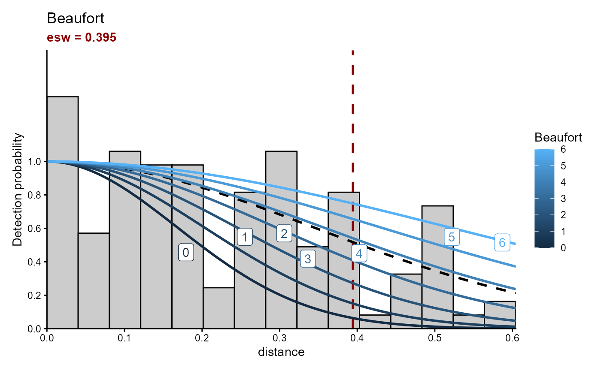
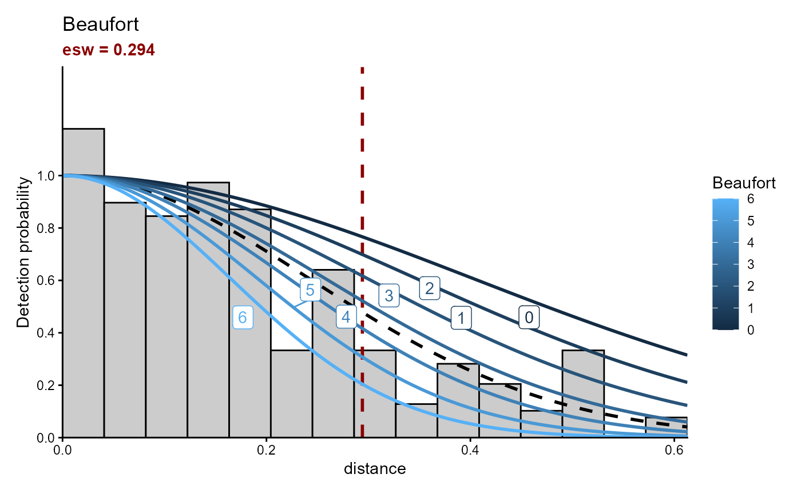

# ESW calculation

``` r
library(pelascope)
#> Warning: replacing previous import 'Distance::create.bins' by
#> 'mrds::create.bins' when loading 'pelaCDS'
#> Warning: replacing previous import 'magrittr::set_names' by 'purrr::set_names'
#> when loading 'pelascope'
```

## esw_hn

## estimate_esw

``` r

estimate_esw(data_sight = pelascope::Sigthings_with_SegID, 
             data_effort = pelascope::data_effort_with_sightings,
             species = "FULGLA", 
             variable = c("Beaufort"), 
             var_factor = FALSE)
#> Calling Distance package, for more information visit:
#> <https://www.st-andrews.ac.uk/mathematics-statistics/research/impact/distance/>.
#> 
#> ── Data cleaning ──
#> 
#> There are 127 sightings in the dataset selected.
#> 
#> ── Model selection ──
#> 
#> Fitting half-normal key function
#> AIC= -138.218
#> ── Best model prediction ──
#> 
#> Fitting half-normal key function
#> AIC= -138.218
#> ESW values estimated, please check units.
#> 
#> ── Update Effort Table ──
#> 
#> $plot_esw
```



    #> 
    #> $data_esw
    #>   Beaufort      mean         sd       Q_25      Q_97
    #> 1        0 0.2277374 0.10441601 0.07833809 0.4671613
    #> 2        1 0.2614858 0.08679197 0.12324032 0.4483420
    #> 3        2 0.3038038 0.06321578 0.19136931 0.4264660
    #> 4        3 0.3540426 0.03737556 0.28192089 0.4230031
    #> 5        4 0.4049607 0.03555450 0.33245976 0.4737157
    #> 6        5 0.4471694 0.05479152 0.32511231 0.5367419
    #> 7        6 0.4780222 0.07092782 0.30671006 0.5736555
    #> 
    #> $model_selection
    #>          model       AIC det_fun
    #> 1 1 + Beaufort -138.2179      hn
    #> 
    #> $effort_output
    #> Simple feature collection with 390 features and 16 fields
    #> Geometry type: POINT
    #> Dimension:     XY
    #> Bounding box:  xmin: -5.657199 ymin: 43.66589 xmax: -1.253505 ymax: 48.31222
    #> Geodetic CRS:  WGS 84
    #> # A tibble: 390 × 17
    #>    Beaufort TransectID         plateform         n_obs LegID Start_time         
    #>       <dbl> <chr>              <chr>             <dbl> <chr> <dttm>             
    #>  1        0 TR_Pelgas_25052023 upper_bridge_out…     2 2505… 2023-05-25 04:57:07
    #>  2        1 TR_Pelgas_04052023 upper_bridge_out…     2 0405… 2023-05-04 11:42:53
    #>  3        1 TR_Pelgas_05052023 upper_bridge_out…     2 0505… 2023-05-05 13:56:44
    #>  4        1 TR_Pelgas_05052023 upper_bridge_out…     2 0505… 2023-05-05 13:56:44
    #>  5        1 TR_Pelgas_05052023 upper_bridge_out…     2 0505… 2023-05-05 13:56:44
    #>  6        1 TR_Pelgas_05052023 upper_bridge_out…     2 0505… 2023-05-05 13:56:44
    #>  7        1 TR_Pelgas_05052023 upper_bridge_out…     2 0505… 2023-05-05 16:09:17
    #>  8        1 TR_Pelgas_18052023 upper_bridge_out…     2 1805… 2023-05-18 11:33:05
    #>  9        1 TR_Pelgas_22052023 upper_bridge_out…     2 2205… 2023-05-22 15:03:10
    #> 10        1 TR_Pelgas_27052023 upper_bridge_out…     2 2705… 2023-05-27 13:24:10
    #> # ℹ 380 more rows
    #> # ℹ 11 more variables: DateTime <dttm>, End_time <dttm>, SegID <chr>,
    #> #   Effort <dbl>, geometry <POINT [°]>, det.FULGLA <dbl>, ind.FULGLA <dbl>,
    #> #   mean_esw_FULGLA <dbl>, sd_esw_FULGLA <dbl>, Q25_esw_FULGLA <dbl>,
    #> #   Q75_esw_FULGLA <dbl>

    estimate_esw(data_sight = pelascope::Sigthings_with_SegID, 
                 data_effort = pelascope::data_effort_with_sightings,
                 species = c("DELDEL", "DELSPP") , 
                 variable = c("Beaufort", "plateform"), 
                 var_factor = FALSE)
    #> Calling Distance package, for more information visit:
    #> <https://www.st-andrews.ac.uk/mathematics-statistics/research/impact/distance/>.
    #> ── Data cleaning ──
    #> 
    #> There are 295 sightings in the dataset selected.
    #> 
    #> ── Model selection ──
    #> 
    #> Fitting half-normal key function
    #> AIC= -422.815
    #> Fitting half-normal key function
    #> AIC= -415.657
    #> Fitting half-normal key function
    #> AIC= -424.395
    #> ── Best model prediction ──
    #> 
    #> Fitting half-normal key function
    #> AIC= -424.395
    #> ESW values estimated, please check units.
    #> 
    #> ── Update Effort Table ──
    #> 
    #> $plot_esw



    #> 
    #> $data_esw
    #>   Beaufort      mean         sd      Q_25      Q_97
    #> 1        0 0.4375417 0.04534669 0.3344845 0.5117686
    #> 2        1 0.4006128 0.03747800 0.3217877 0.4674815
    #> 3        2 0.3599031 0.02701889 0.3054361 0.4118558
    #> 4        3 0.3177052 0.01637276 0.2869445 0.3501595
    #> 5        4 0.2769336 0.01237129 0.2536810 0.3020598
    #> 6        5 0.2399628 0.01769511 0.2068968 0.2770143
    #> 7        6 0.2077503 0.02425518 0.1660574 0.2583932
    #> 
    #> $model_selection
    #>                      model       AIC det_fun
    #> 1             1 + Beaufort -424.3949      hn
    #> 2 1 + Beaufort + plateform -422.8151      hn
    #> 3            1 + plateform -415.6568      hn
    #> 
    #> $effort_output
    #> Simple feature collection with 390 features and 20 fields
    #> Geometry type: POINT
    #> Dimension:     XY
    #> Bounding box:  xmin: -5.657199 ymin: 43.66589 xmax: -1.253505 ymax: 48.31222
    #> Geodetic CRS:  WGS 84
    #> # A tibble: 390 × 21
    #>    Beaufort TransectID         plateform         n_obs LegID Start_time         
    #>       <dbl> <chr>              <chr>             <dbl> <chr> <dttm>             
    #>  1        0 TR_Pelgas_25052023 upper_bridge_out…     2 2505… 2023-05-25 04:57:07
    #>  2        1 TR_Pelgas_04052023 upper_bridge_out…     2 0405… 2023-05-04 11:42:53
    #>  3        1 TR_Pelgas_05052023 upper_bridge_out…     2 0505… 2023-05-05 13:56:44
    #>  4        1 TR_Pelgas_05052023 upper_bridge_out…     2 0505… 2023-05-05 13:56:44
    #>  5        1 TR_Pelgas_05052023 upper_bridge_out…     2 0505… 2023-05-05 13:56:44
    #>  6        1 TR_Pelgas_05052023 upper_bridge_out…     2 0505… 2023-05-05 13:56:44
    #>  7        1 TR_Pelgas_05052023 upper_bridge_out…     2 0505… 2023-05-05 16:09:17
    #>  8        1 TR_Pelgas_18052023 upper_bridge_out…     2 1805… 2023-05-18 11:33:05
    #>  9        1 TR_Pelgas_22052023 upper_bridge_out…     2 2205… 2023-05-22 15:03:10
    #> 10        1 TR_Pelgas_27052023 upper_bridge_out…     2 2705… 2023-05-27 13:24:10
    #> # ℹ 380 more rows
    #> # ℹ 15 more variables: DateTime <dttm>, End_time <dttm>, SegID <chr>,
    #> #   Effort <dbl>, geometry <POINT [°]>, det.DELDEL <int>, ind.DELDEL <int>,
    #> #   det.DELSPP <int>, ind.DELSPP <int>, ind.DELDEL_DELSPP <dbl>,
    #> #   det.DELDEL_DELSPP <dbl>, mean_esw_DELDEL_DELSPP <dbl>,
    #> #   sd_esw_DELDEL_DELSPP <dbl>, Q25_esw_DELDEL_DELSPP <dbl>,
    #> #   Q75_esw_DELDEL_DELSPP <dbl>
